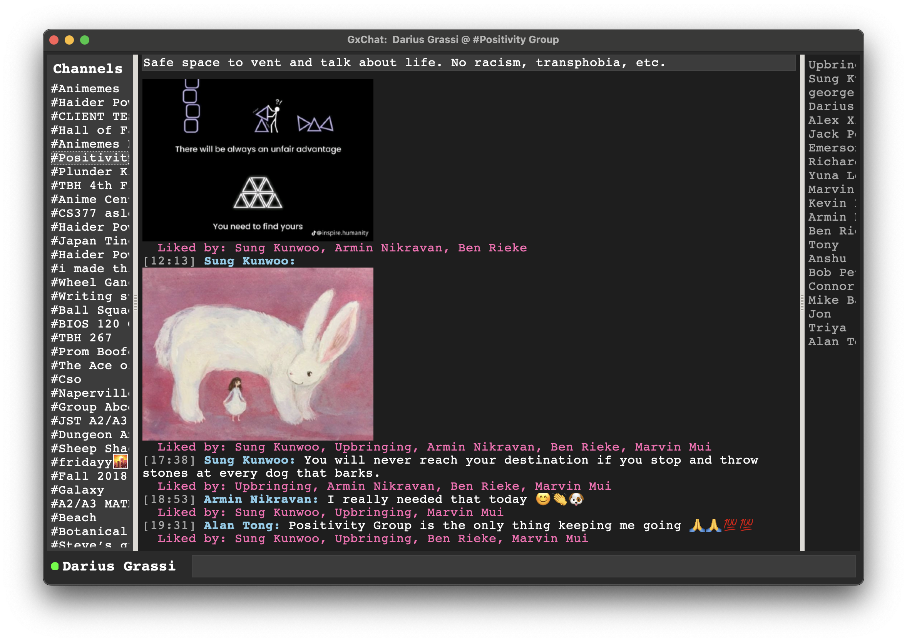

# GxChat

[](https://github.com/dariusgrassi/GxChat/actions/workflows/ci.yml)

GxChat is a cross-platform chat application designed to interact with the GroupMe API. It features a Python (Tkinter) frontend for the user interface and a high-performance Rust (Axum) backend for handling API requests and real-time communication.

## Features

-   **Channel Listing:** View all your GroupMe channels.
-   **Message History:** Display chat history for selected channels, including text and images.
-   **Message Sending:** Send messages to GroupMe channels.
-   **Live Like Updates:** See message likes update in real-time (via polling).
-   **User Information:** Display current user details.
-   **Containerized Backend:** Easy setup and consistent environment for the Rust backend using Docker.
-   **Pre-commit Hooks:** Automated code quality checks for Python (Ruff, MyPy) and Rust (Rustfmt, Clippy).

## Appearance

Here is a screenshot of the GxChat interface:



## Architecture

-   **Frontend:** Python 3.x with Tkinter for the GUI.
-   **Backend:** Rust with the Axum web framework, acting as a proxy to the GroupMe API.
-   **Real-time:** Uses GroupMe's Faye push service for new message notifications and polling for like updates.

## Setup and Running

Follow these steps to get GxChat up and running on your local machine.

### Prerequisites

-   [Python 3.x](https://www.python.org/downloads/)
-   [pip](https://pip.pypa.io/en/stable/installation/)
-   [Docker Desktop](https://www.docker.com/products/docker-desktop) (for running the Rust backend)

### 1. Clone the Repository

```bash
git clone https://github.com/dariusgrassi/GxChat.git
cd GxChat
```

### 2. Run the Backend (Docker)

Navigate to the root of the `GxChat` directory and use Docker Compose to build and run the backend service:

```bash
docker-compose up --build
```

This command will:
-   Build the Rust backend Docker image.
-   Start the backend container, listening on `http://127.0.0.1:3000`.

Leave this terminal window open, as the backend will be running in the foreground.

### 3. Set up the Frontend (Python)

In a new terminal window, navigate to the root of the `GxChat` directory and install the Python dependencies:

```bash
pip install -r requirements.txt
```

### 4. Install Pre-commit Hooks (Recommended)

To ensure code quality and consistency, install the pre-commit hooks. These will run automatically before each commit.

```bash
pre-commit install
```

### 5. Run the Frontend

From the root of the `GxChat` directory, start the Python frontend:

```bash
python main.py
```

The GxChat application window should now appear. You will be prompted to log in with GroupMe via your web browser.

## Roadmap

For planned features and future development, please refer to the [ROADMAP.md](ROADMAP.md) file.

## Contributing

Contributions are welcome! Please see the [ROADMAP.md](ROADMAP.md) for ideas or open an issue to discuss new features or bug fixes.

## Disclaimer and API Usage

This project is a personal side project and is not sponsored by, endorsed by, or affiliated with GroupMe.

This application relies on the GroupMe API. Your use of this project, and any interactions it makes with GroupMe services, is subject to the terms and conditions of the [GroupMe API License Agreement](https://dev.groupme.com/GroupMe_API_License_Agreement.pdf). Please review their license carefully.

---

powered by GroupMe®
